# HW3
Part 1 Antconc
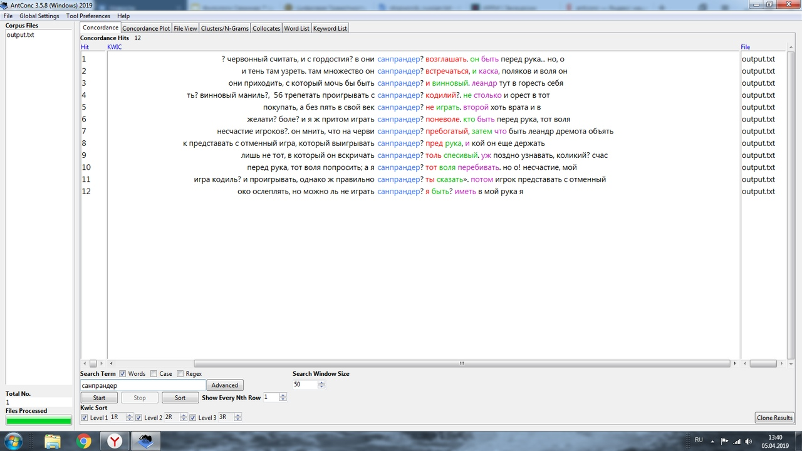
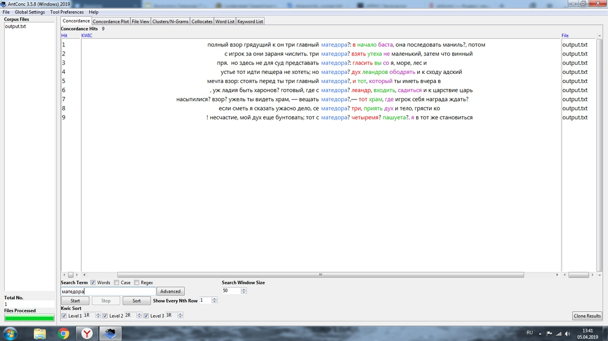
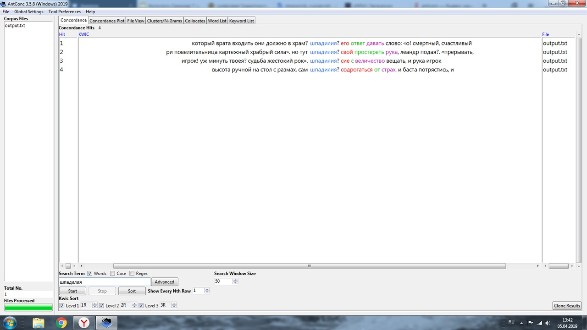
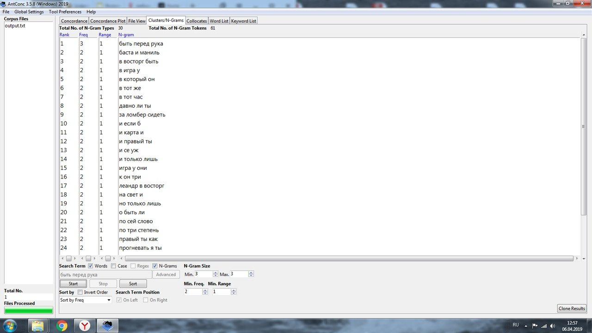
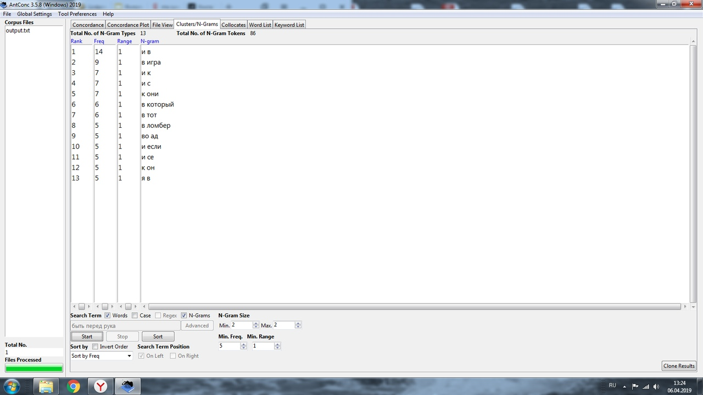
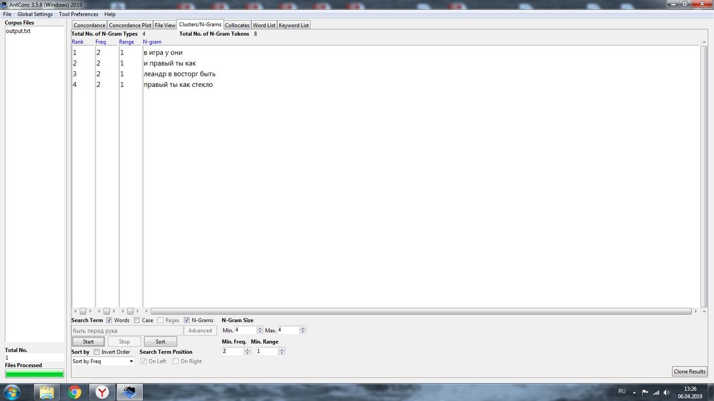
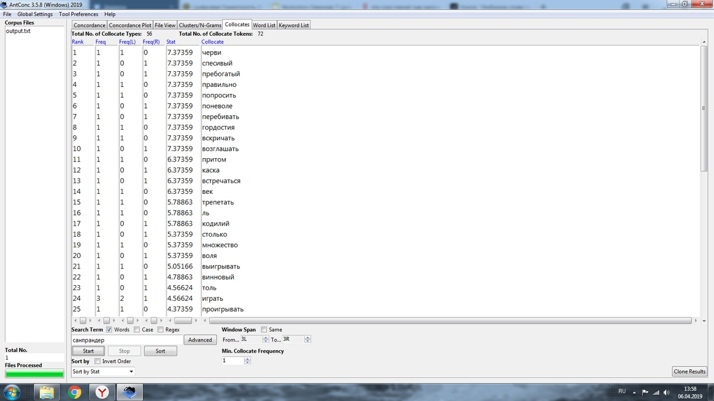
Part 2 Google N-grams and Russian Corpus
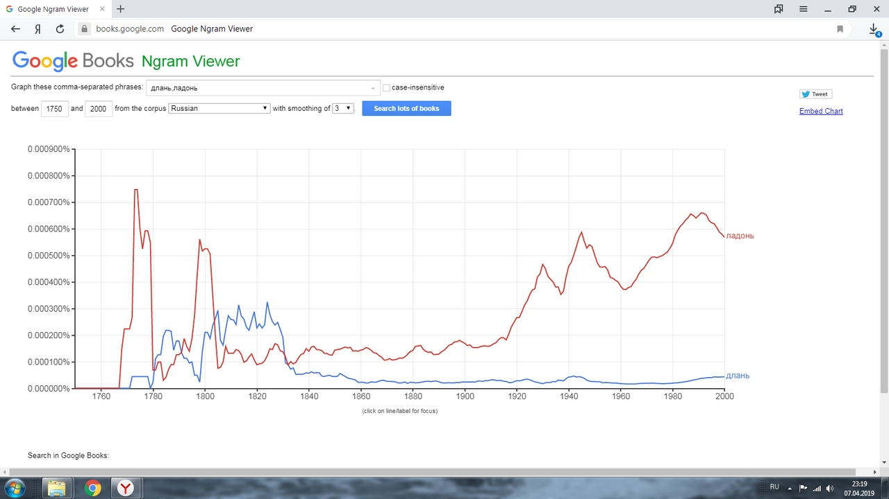
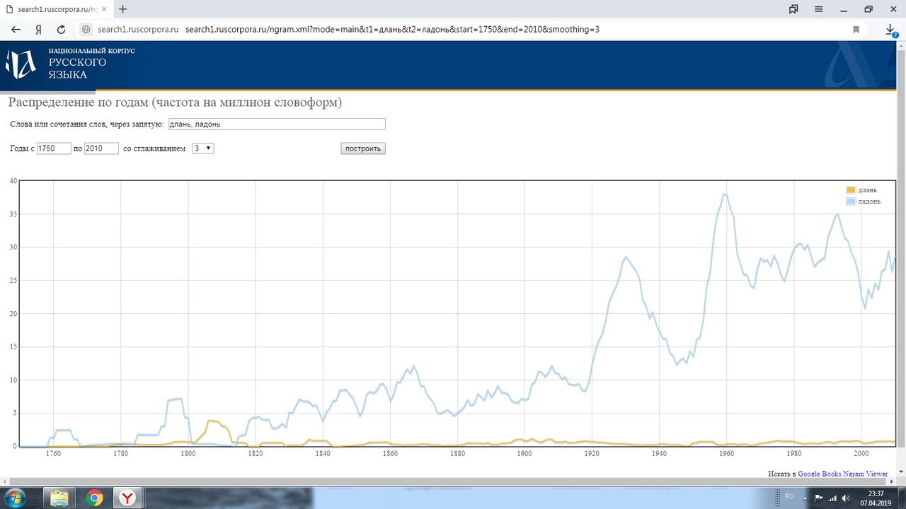
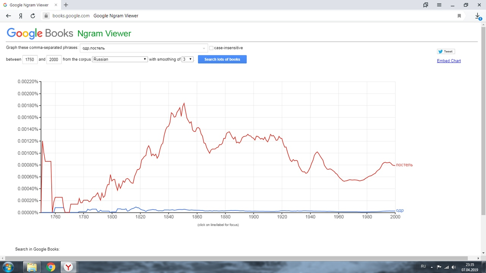
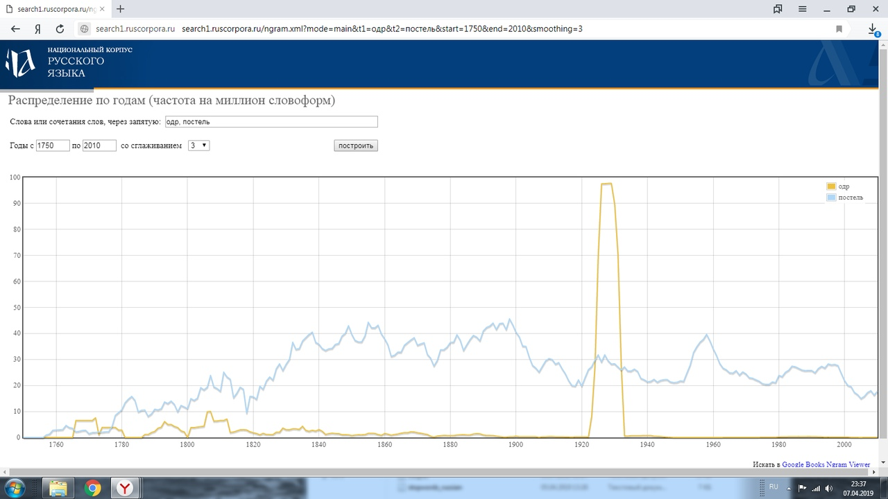
В период написания "Игрока Ломбера" оба варианта слов использовались в достаточно схожем количестве, однако с годами утвердились современные нам варианты, в то время как использование устаревших форм резко сократилось
ipm "длань"= 1,340709749019629

ipm "одр"= 9,667222927141535
